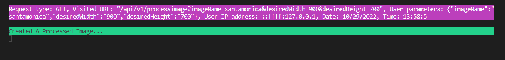
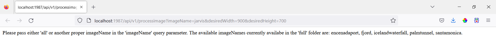

# Udacity's Advanced Fullstack Web Development Nanodegree - Project1 (API for Image Processing)


[](https://www.udacity.com/)


## sponsored and funded by [egFWD](https://egfwd.com/) 

[](https://egfwd.com/)


*author*: **Ahmed E. F. R. Mohammed**


* [Package.json-scripts](#Package.json-scripts)
* [Proper-use](#Proper-use)
* [Endpoint](#Endpoint)
* [Notifications](#Notifications)
* [Error-Handling](#Error-Handling)
* [Notice](#Notice)


-----------------------
## Package.json-scripts
-----------------------

- **```npm install```**: This is the first script to run in order to install all the dependencies and devDependencies needed for the project to function properly. 

**Screenshot - the result of running `install` script**


- **```npm run prettier```**: To apply the prettier rules to the code base, in order to ensure consistency for how the code is displayed.

**Screenshot - the result of running `prettier` script**


- **```npm run eslint```**: This "eslint" command will help you to write proper TypeScript code, but ensuring that there is no implict typing throughout the codebase.

**Screenshot - the result of running `eslint` script**


- **```npm run build```**: Once you're done coding your project in TypeScript, it is now the time to convert it to commonjs.

**Screenshot - the result of running `build` script**


- **```npm run jasmine```**: will condict unit testing using the jasmine testing framework. The testing result will be displayed in the console.

**Screenshot - the result of running `jasmine` script: PLEASE NOTE that the highlighted segments appearing in magenta, green and red are NOT error messages. They are colored notifications. This is further explain in BOTH the [Notifications](#Notifications) and the [Notice](#Notice) sections**


- **```npm run test```**: will run the aforementioned "build" and "jasmine" commands consecutively.

**Screenshot - the result of running `test` script": PLEASE NOTE that the highlighted segments appearing in magenta, green and red are NOT error messages. They are colored notifications. This is further explain in BOTH the [Notifications](#Notifications) and the [Notice](#Notice) sections**


- **```npm run start```**: will start the development server using nodemon.

**Screenshot - the result of running `start` script**


-------------
## Proper-use
Once your start the server, it will be listening on port 1987. Once you visit the 'http://localhost:1987/', you will be greeting with a landing page that serves as a guideline on how to use the API and its features, as demonstrated below:


-----------
## Endpoint
-----------
http://localhost:1987/api/v1/processimage

In order for the API to function properly, three query parameters are needed:
- _imageName_: Available filenames are:
  - These could be one of the images' names located in the `assets/images/full`, such as:
    - encenadaport
    - fjord
    - icelandwaterfall
    - palmtunnel
    - santamonica
  - Or you can use the keyword `all`, and in this case, all the images located in the `assets/images/full` will be processed at once.   
- _desiredWidth_: A positive number of pixels that you wish to have for the image width.
- _desiredHeight_: A positive number of pixels that you wish to have for the image height.

Here are a few examples of properly formatted URLs:

http://localhost:1987/api/v1/processimage?imageName=fjord&desiredWidth=900&desiredHeight=700

This will result in creating a resized image of the `fjor` image located in the `assets/images/full`, with a 900 pixels width and 700 pixels height. The processed image will be saved in the `assets/images/thumb`.

http://localhost:1987/api/v1/processimage?imageName=all&desiredWidth=600&desiredHeight=900

In this case, the user have used the keyword `all` as entry for the `imageName` parameter. This will result in processing all the images located in the `assets/images/full` to be 600 pixels wide and 900 pixels height. They will all be saved to the `assets/images/thumb`.

----------------
## Notifications
----------------

A number of **colored CLI notifications** were made for **the purpose of ease-of-use from a system admin perspective**, here is an overview of how they all look, with further explaination for each of them afterwards:


- **Magenta notification** is displayed once the API receives a call. It is displayed in the CLI with details about the nature of the API call: such as the **_request type_**, **_visited url_**, the user **_ip address_**, the **_parameters_** eneterd by the usre, and the **_date and time_** on which the API call was made, as displayed below.


- **Green notification** is displayed in the CLI if **_the creation of a processed image, or a groud of processed images, was successful_**. From the magenta-colored notification above it, you can see that the resized image created was for 'santamonica' with a width and height of 900 and 700 pixels respectively, and that the resized image was succesfully created as shown in the green-colored notification. 



- **Red notification 1** is displayed in the CLI if the user tries to make a new processed image from the same original with the same dimensions (i.e. width and height). In other words, if the user **_tries to recreate a resized image that was previously created and still present in the `thumb` folder_**, this will result in a red-colored notification in the CLI. In the case displayed below, and shown in the magenta-colored notification above the red one, the user tried to create a resized image for 'santamonica' with a width and height of 900 and 700 pixels respectively, but that was unsuccessful due to the fact that there is already an image with the same name and dimensions already created and stored, as shown in the red-colored notification. 


- **Red notification 2** is displayed if the user tries to process all the images in the `full` folder (using the keyword `all`, as previously explained in the [Endpoint](#Endpoint) section) AGAIN with the same dimensions (i.e. width and height). As shown below, a red-colored notification is displayed **_to inform the user that he had already processed all the images in the `full` folder with these same dimensions_** (i.e. width of 900 pixels and height of 700 pixels) before, as shown in the magenta-colored notifcation right above it (i.e. _User parameters : {"imageName": "all", "desiredWidth": "900", "desiredHeight": "700"}_).


-----------------
## Error-Handling
-----------------

### #missing imageName parameter

**Example URL:** http://localhost:1987/api/v1/processimage?desiredWidth=900&desiredHeight=700

**Outcome:** 


### #wrong imageName parameter (image name that does NOT exist in the `full` folder)

**Example URL:** http://localhost:1987/api/v1/processimage?imageName=jarvis&desiredWidth=900&desiredHeight=700

**Outcome:** 




### #missing desiredWidth parameter

**Example URL:** http://localhost:1987/api/v1/processimage?imageName=santamonica&desiredHeight=700

**Outcome:** 


### #wrong desiredWidth parameter

**Example URL 1: (negative number)** http://localhost:1987/api/v1/processimage?imageName=santamonica&desiredWidth=-1&desiredHeight=700

**Outcome:** 


**Example URL 2: (a string of characters)** http://localhost:1987/api/v1/processimage?imageName=santamonica&desiredWidth=jarvis&desiredHeight=700

**Outcome:** 


### #missing desiredHeight parameter

**Example URL:** http://localhost:1987/api/v1/processimage?imageName=santamonica&desiredWidth=900

**Outcome:** 


### #wrong desiredHeight parameter

**Example URL 1: (negative number)** http://localhost:1987/api/v1/processimage?imageName=santamonica&desiredWidth=900&desiredHeight=-1

**Outcome:** 


**Example URL 2: (a string of characters)** http://localhost:1987/api/v1/processimage?imageName=santamonica&desiredWidth=900&desiredHeight=jarvis

**Outcome:** 


### #missing BOTH the desiredWidth and desiredHeight parameter

**Example URL:** http://localhost:1987/api/v1/processimage?imageName=fjord

**Outcome:** The original image will be loaded from the `full` folder, and displayed in the browser.


### #trying to re-process and already processed image with the same dimensions

**Example URL (run it twice):** http://localhost:1987/api/v1/processimage?imageName=santamonica&desiredWidth=900&desiredHeight=700

**Outcome (shown in browser):** A cached version, that was loaded from the `thumb` folder, is displayed.


**Outcome (shown in CLI):** A red-colored notification is displayed in the CLI, as explained in the [Notifications](#Notifications) section.


### #trying to re-process all the images in the `full` folder with the same dimensions

**Example URL (run it twice):** http://localhost:1987/api/v1/processimage?imageName=all&desiredWidth=900&desiredHeight=700

**Outcome (shown in browser):** A cached version, that was loaded from the `thumb` folder, of the last alpha-numerically listed image is displayed. In this case, since the image titled "santamonica" is staring with an "s" (hence it is the last image in the folder from an alphabetical point of view), it is the one displayed.


**Outcome (shown in CLI):** A red-colored notification is displayed in the CLI, as explained in the [Notifications](#Notifications) section.


## Notice
- Once the server starts running, and a call is made to the API using the proper formatting, as stated abovem, a logger file titled **`loggerFile.txt` will be created under `assets/`**, and will remain there even after the server is down. This file is designed to persist on desk for the lifetime of the API to continually store details of the functioning as well as usage of the API. If deleted by any change, once the server received a new API call, it will be re-created again. The previously stored data is gone nontheless, and this newly created logger fille will serve as a fresh start.

- If the `thumb` folder is NOT available when downloading the project, it is automatically created upon the first call to the API.

- If by any chance, you end up deleting the `full` folder, you will need to recreate it manually. The same applies to the parent folder of `images` and `assets` respectively. Otherwise, the API will NOT function properly and breaks down. **This functionality is intential**, to make sure that the user understands where to put the (original) photos on which he wants to conduct the resizing, and where he will get the new (processed) ones after conducting the processing operation on them. 

- Once the testing in **jasmine** is run, **7 messages/notifications will appear, 3 highlighted in magenta, 2 in green and 2 in red. They are NOT erorrs!**. These are just confirmation that the testing is successful, as will be demonstrated below:


  - **Magenta messages/notification:**
    - A test was made in the `/tests/indexSpec.ts` to test the statusCode of (200) upon visiting the `'/'` endpoint, it was successful (hence the magenta notification...For further understanding, read the [Notifications](#Notifications) section above). 

    - A test was made in the `/tests/indexSpec.ts` to test the statusCode of (200) upon visiting the `'/api'` endpoint, it was successful (hence the magenta notification...For further understanding, read the [Notifications](#Notifications) section above).

    - A test was made in the `/tests/indexSpec.ts` to test the statusCode of (200) upon visiting the `'/api/v1/processimage?imageName=santamonica&desiredWidth=900&desiredHeight=700'` endpoint, it was successful (hence the magenta notification...For further understanding, read the [Notifications](#Notifications) section above).


    - **Green message/notification:** 
      - A test was made to testing the functionality of the `tests/modules/createProcessedImage.moduleSpec` module, which creates a processed image. The green message is a confirmation that this image is indeed created. It runs automatically once the module is summons and its main function is called (hence the green notification...For further understanding, read the [Notifications](#Notifications) section above).

      - Upon conducting the 3rd test stated under the `Magenta messages/notification:` section (right above this section), it was successfull. Since it is a valid URL with an all valid parameters, a new process image was created (hence the green notification...For further understanding, read the [Notifications](#Notifications) section above). 


  - **Red messages/notification:**
    - A test was made in the `tests/modules/CreateProcessedImage.moduleSpec` to test whether a processed image exists or not, and it was successful (hence the red notification...For further understanding, read the [Notifications](#Notifications) section above).

    - A test was made in the `tests/modules/processImageWithSharp.moduleSpec` to test whether a processed image exists or not, and it was successful (hence the red notification...For further understanding, read the [Notifications](#Notifications) section above).

  - Please note that the number of colored notification appearing during the jasmine testing depends on how many API calls were made, and how many images were created **prior** to running the jasmine testing. Those **7 messages/notifications** are the ones that will appear if you're starting on a clean slate, with no prior operations made, API called, or images processed and resized. In other words, those **7 messages/notifications** will appear if you start by running the scripts one by one as described above in the [Package.json-scripts](#Package.json-scripts) section.


